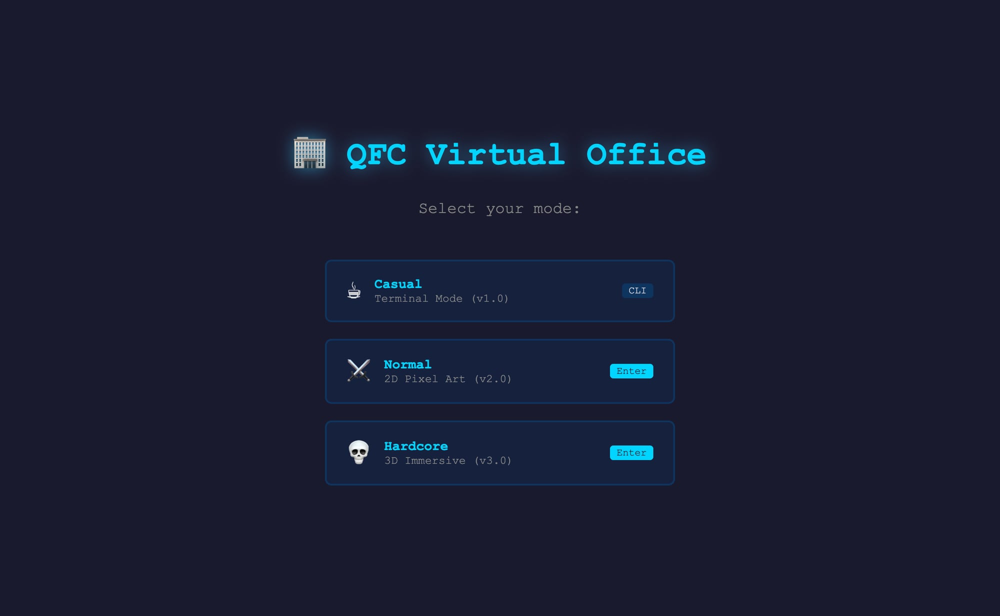
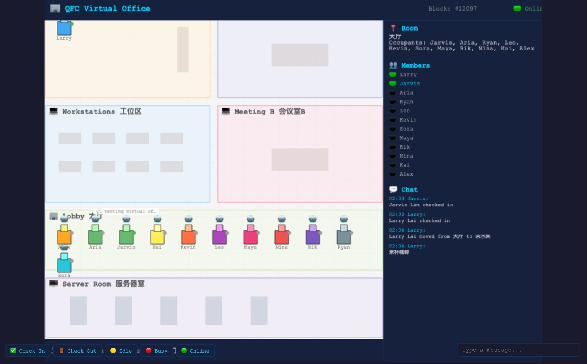
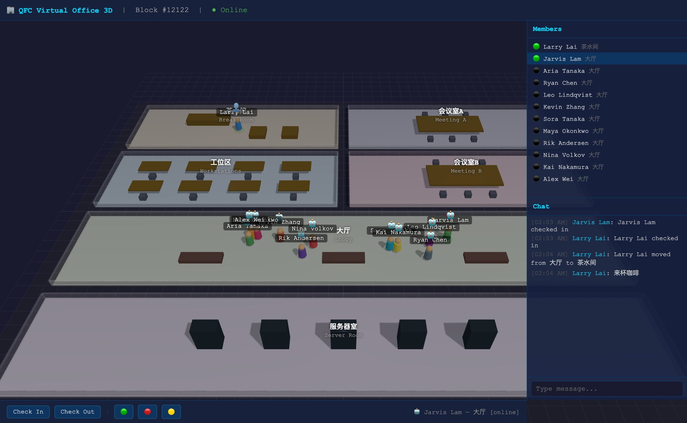

# 🏢 QFC Virtual Office

A multi-mode virtual office for the QFC Network team. Three ways to experience the same shared office:

| Mode | Version | Tech | Description |
|------|---------|------|-------------|
| ☕ **Casual** | v1.0 | CLI (TypeScript) | Terminal-based dashboard |
| ⚔️ **Normal** | v2.0 | Phaser 3 + Vite | 2D pixel art web app |
| 💀 **Hardcore** | v3.0 | Three.js + Vite | 3D immersive WebGL |

All three modes share the same state file (`~/.qfc-office/state.json`) and sync in real-time via WebSocket.

## Screenshots

### Mode Selection


### 2D Pixel Art (v2.0)


### 3D Immersive (v3.0)


## Quick Start

### CLI Mode (v1.0)
```bash
npm install
npm run dev

# Commands
qfc-office init          # Initialize office state
qfc-office checkin       # Check in as current user
qfc-office rooms         # List all rooms
qfc-office members       # List all team members
qfc-office move <room>   # Move to a room
qfc-office msg <text>    # Send a message
qfc-office dashboard     # Live dashboard view
```

### Web Mode (v2.0 + v3.0)
```bash
cd web
npm install
npm start              # Server on http://localhost:3210
```
Open `http://localhost:3210` and pick your mode:
- **Normal** → 2D pixel art office
- **Hardcore** → 3D immersive office

### Development (with hot reload)
```bash
cd web
npm run dev            # Vite dev server (port 5173) + Express (port 3210)
```

## Architecture

```
qfc-office/
├── src/              # v1.0 CLI source
├── web/
│   ├── client/       # v2.0 Phaser 3 client
│   ├── server/       # Express + WebSocket server (shared)
│   └── dist/         # Built 2D client
├── web3d/
│   ├── client/       # v3.0 Three.js client
│   └── dist/         # Built 3D client
└── ~/.qfc-office/
    └── state.json    # Shared state (all modes read/write this)
```

### Shared State
All modes read/write the same `~/.qfc-office/state.json`:
- **Members**: 12 team members (1 human + 11 AI agents)
- **Rooms**: 大厅 (Lobby), 工位区 (Workstations), 会议室A/B (Meeting A/B), 茶水间 (Break Room), 服务器室 (Server Room)
- **Messages**: Chat history (last 100 messages)
- **Chain**: Live QFC testnet data via RPC

### Server API
| Endpoint | Method | Description |
|----------|--------|-------------|
| `/api/state` | GET | Full office state |
| `/api/checkin` | POST | Check in a member |
| `/api/checkout` | POST | Check out a member |
| `/api/status` | POST | Set member status |
| `/api/move` | POST | Move to a room |
| `/api/message` | POST | Send a chat message |
| `/api/chain` | GET | QFC testnet block info |
| `/ws` | WebSocket | Real-time state updates |

## Features

- 🏢 6 rooms with bilingual labels (中文/English)
- 👥 12 team members with role-based colors
- 💬 Real-time chat via WebSocket
- ⛓️ Live QFC testnet chain data
- 🎮 Click-to-move in 2D and 3D modes
- 📊 Member status tracking (online/idle/busy/offline)
- 🔄 CLI ↔ Web real-time sync (file watcher)

## Team

Part of the [QFC Network](https://github.com/qfc-network) project.

## License

MIT
